# HashConfig Tool  

NOTICE: This (software/technical data) was produced for the U. S. Government 
under Contract Number HHSM-500-2012-00008I, and is subject to Federal 
Acquisition Regulation Clause 52.227-14, Rights in Data-General. No other use 
other than that granted to the U. S. Government, or to those acting on behalf 
of the U. S. Government under that Clause is authorized without the express 
written permission of The MITRE Corporation. For further information, please 
contact The MITRE Corporation, Contracts Management Office, 7515 Colshire 
Drive, McLean, VA 22102-7539, (703) 983-6000.
 ©2016 The MITRE Corporation.

#### This is the README file for the hashconfig tool.

## Overview
HashConfig is an open-source, standalone Node.js application that automates the 
process of editing a JavaScript Object Notation (JSON) file. This tool is 
intended to be used for JSON configuration files as part of a more automated 
approach to software installation, but can be extended to any JSON file. 
The software reads a template JSON file and extracts all its field values. For 
each field, it then prompts the user to either accept the given default value 
or to provide a custom value. At the end of the user input process, the 
software generates a new configuration file with the specified values.

The HashConfig application also provides users with a more secure way to store 
and use configuration files. By default, it encodes all field values in the new 
configuration file using simple Base64 encoding for protection of sensitive 
information. The user may also elect to decode the new configuration file for 
easier readability in a case where such security measures are not needed. Other 
available options include automatically accepting all default values, decoding 
an encoded template file, and using an additional helper software to update or 
modify the user’s new values. HashConfig provides users with a faster, simpler, 
and more secure way to generate JSON configuration files.

## To Get Started
1. Open the parent directory where the hashconfig repository will be placed.  
&nbsp;

2. Clone this repository and open the hashconfig folder by running "cd 
hashconfig" in the command prompt.  
&nbsp;

3. Install the required node.js modules by running "npm install" in the command 
prompt. 

	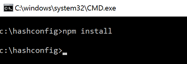

 
 
## Code Structure
* package.json contains a brief description of the program along with a list of 
the required modules.
* hconfig.js is the main file, which reads the config.json_TEMPLATE file, 
prompts the user to either accept the default configuration values or input 
custom values, and outputs a configuration file called config_new.json.
* updateconfig.js is an additional file that can be used for making small 
changes to the config_new.json file.

## Instructions for Use
1. Open the appropriate local directory in the command prompt.  
&nbsp;

2. Type "node hconfig.js" in the command line.

	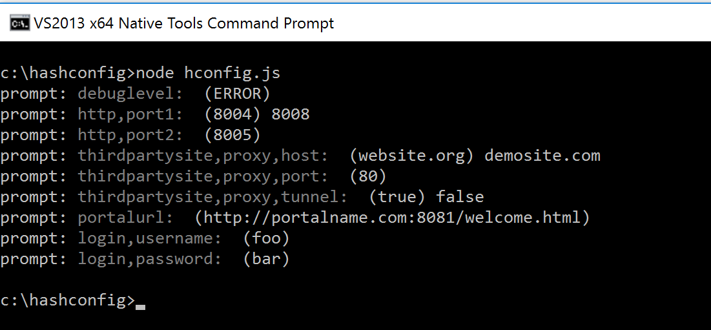  

3. (Optional) Adding the argument '--force' or '-f' ("node hconfig.js --force") 
automatically generates config_new.json using the values given in 
config.json_TEMPLATE.

 
	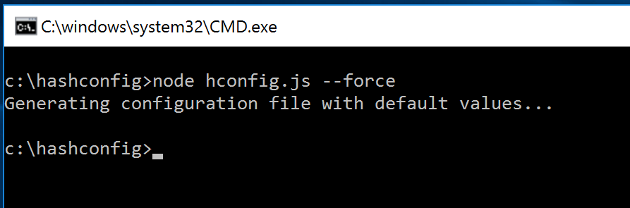  

4. (Optional) Adding the argument '--decode-input' or '-i' ("node hconfig.js 
--decode-input") decodes an encoded config template file. 

	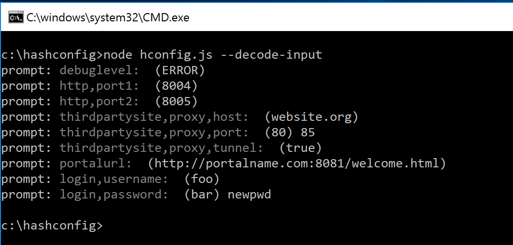  

5. (Optional) Adding the argument '--decode-output' or '-o' ("node hconfig.js 
--decode-output") returns an output file that is not encoded.

	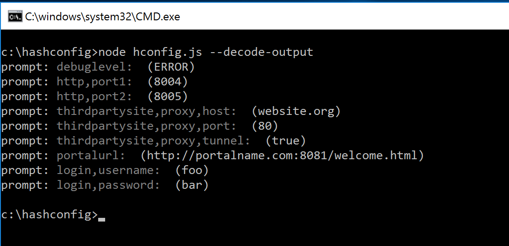

	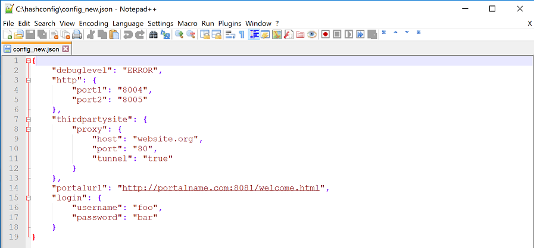  

6. Follow prompts for user input. The user may also add any combination of the 
optional arguments. Note: If arguments are entered incorrectly, or if the user 
inputs the '--help' or '-h' argument, help text will appear and the program 
will exit.

	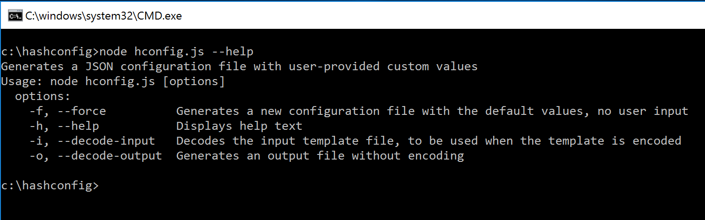  

7. After index.js has finished running, open config_new.json in the same 
directory to see the new encoded configuration file.

	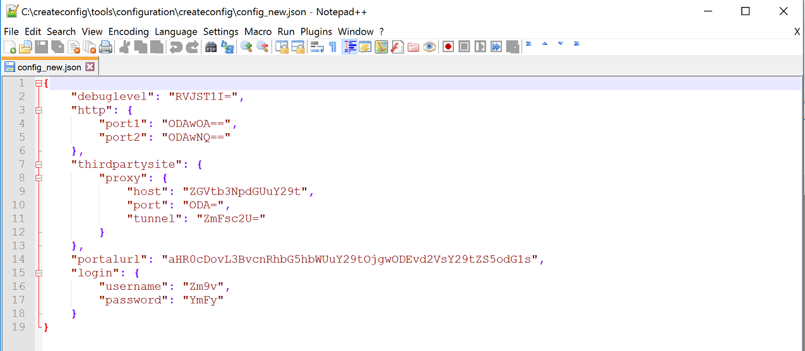  

8. (Optional) If a field needs to be changed in config_new.json, type "node 
updateconfig.js" in the command line, and follow prompts for user input. This 
program uses the '--decode-input' and '--decode-output' command line arguments 
in the same manner as hconfig.js. For example, we can modify the encoded 
config_new.json file that we created in step 2 using the '--decode-input' 
argument.

	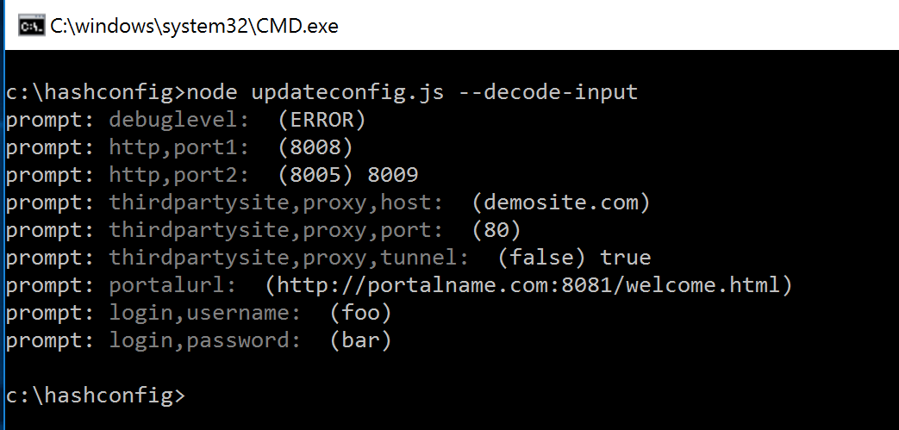  

9. Follow prompts for user input. Note: If arguments are entered incorrectly, 
or if the user inputs the '--help' or '-h' argument, help text will appear and 
the program will exit.

	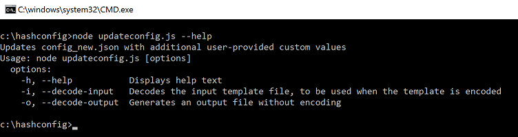  

10. After updateconfig.js has finished running, open config_updated.json in the 
same directory to see the new encoded configuration file.

	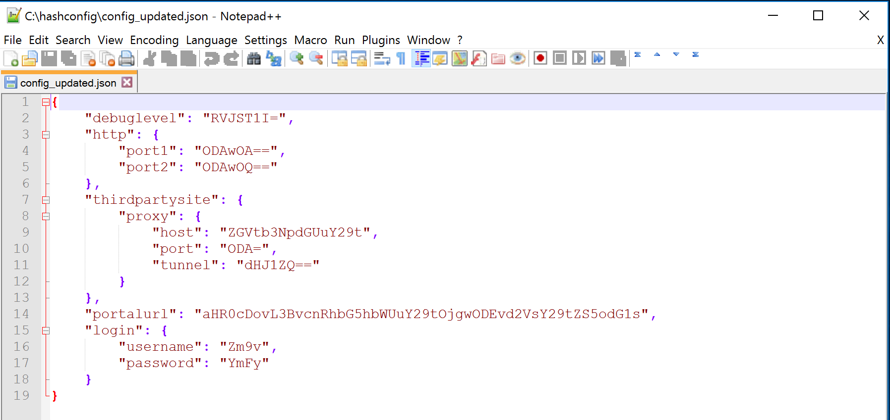

